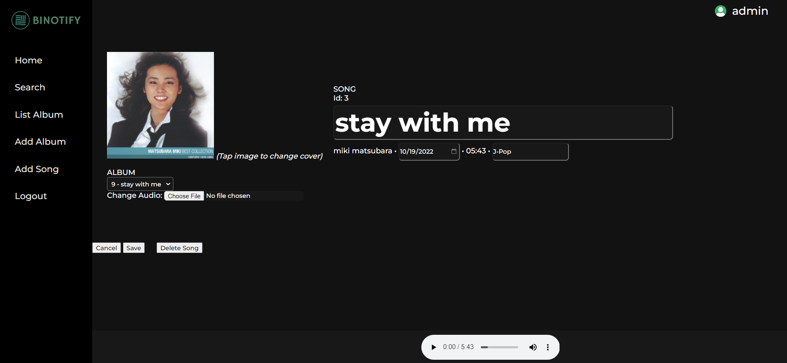

# TUGAS Tugas Besar 1 IF3110

## Milestone 1 -  Monolithic PHP & Vanilla Web Application
Website Binotify merupakan aplikasi musik berbasis web pada BNMO. BNMO adalah mesin yang kuno sehingga hanya kuat untuk menjalankan sebuah DBMS (PostgreSQL/MariaDB/MySQL) dan PHP murni beserta HTML, CSS, dan Javascript vanilla.

## Daftar Requirement
- XAMPP
- MySQL
- PHP
- Apache
- Docker

## Cara intalasi
1. instal [XAMPP](https://www.apachefriends.org/download.html)
2. install [Docker](https://www.apachefriends.org/download.html)
3. Ikuti perintah yang terdapat pada website

## Cara Menjalankan Aplikasi

### Menggunakan XAMPP
1. instal [XAMPP](https://www.apachefriends.org/download.html)
2. Jalankan Apache dan MySQL pada aplikasi XAMPP
3. Buka ```phpmyadmin```
4. Buat Database dengan nama ```binotify```
5. export file ```binotify.sql``` (yang terdapat pada folder sql) ke dalam database yang telah dibuat sebelumnya
6. ketikan URL ```localhost/home``` pada browser 

### Menggunakan Docker
1. instal [Docker](https://www.apachefriends.org/download.html)
2. jalankan perintah ```docker compose up``` pada root folder
3. aplikasi akan berjalan pada ```localhost:8008```
(pada saat menjalankan Docker masih terdapat beberapa fitur yang mengalami eror )

## Tampilan Website

1. Halaman Login


2. Halaman Register


3. Halaman Home


4. Halaman Daftar Album


5. Halaman Search, Sort, and Filter


6. Halaman Detail Lagu


7. Halaman Detail Album


8. Halaman Tambah Album/Lagu


9. Halaman Daftar User


## Pembagian Tugas


## Panduan Pengerjaan
Berikut adalah hal yang harus diperhatikan untuk pengumpulan tugas ini:
1. Buatlah grup pada Gitlab dengan format "IF3110-2022-KXX-01-YY", dengan XX adalah nomor kelas dan YY adalah nomor kelompok.
2. Tambahkan anggota tim pada grup anda.
3. **Fork** pada repository ini dengan organisasi yang telah dibuat.
4. Ubah hak akses repository hasil Fork anda menjadi **private**.
5. Hal-hal yang harus diperhatikan.
    * Silakan commit pada repository anda (hasil fork)
    * Lakukan beberapa commit dengan pesan yang bermakna, contoh: “add register form”, “fix logout bug”, jangan seperti “final”, “benerin dikit”, “fix bug”.
    * Disarankan untuk tidak melakukan commit dengan perubahan yang besar karena akan mempengaruhi penilaian (contoh: hanya melakukan satu commit kemudian dikumpulkan).
    * Sebaiknya commit dilakukan setiap ada penambahan fitur.
    * Commit dari setiap anggota tim akan mempengaruhi penilaian.
    * Jadi, setiap anggota tim harus melakukan commit yang berpengaruh terhadap proses pembuatan aplikasi.
    * Sebagai panduan bisa mengikuti [semantic commit](https://gist.github.com/joshbuchea/6f47e86d2510bce28f8e7f42ae84c716).
6. Buatlah file README yang berisi:
    * Deskripsi aplikasi web
    * Daftar requirement
    * Cara instalasi
    * Cara menjalankan server
    * Screenshot tampilan aplikasi (tidak perlu semua kasus, minimal 1 per halaman), dan 
    * Penjelasan mengenai pembagian tugas masing-masing anggota (lihat formatnya pada bagian pembagian tugas).
